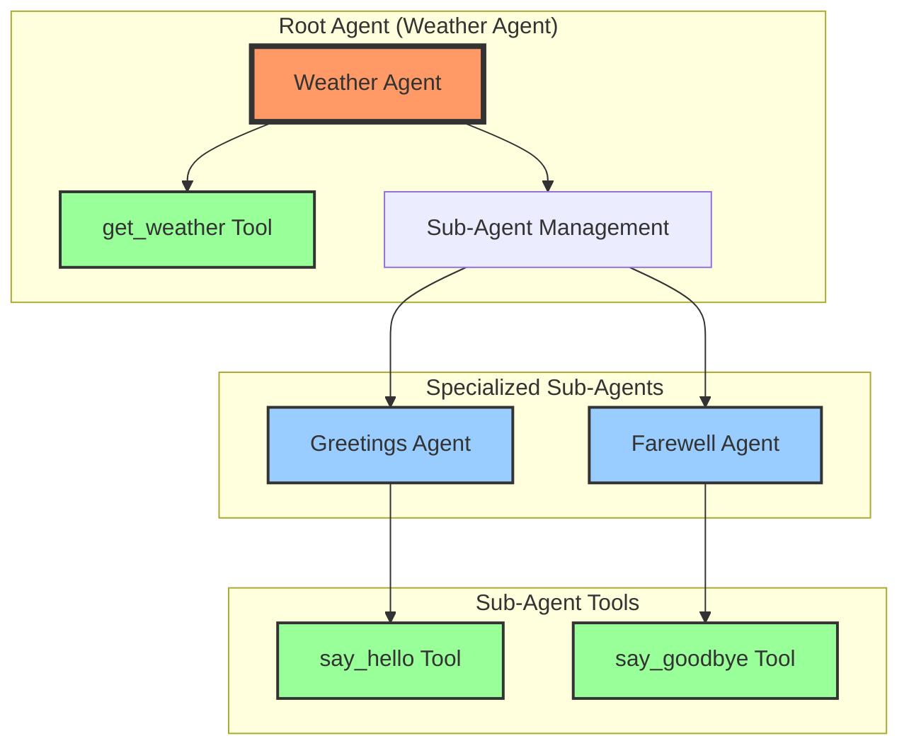

# Google ADK Multi-Agent Service

This repository is built based on Google ADK (Agent Development Kit) tutorial. It implements a multi-agent service with centralized logging and MCP client integration for tool interactions. Developed by [BansalAI](https://www.bansalai.com) - Your partner for enterprise AI solutions.

## Features

### Implemented
✅ **Tool Definition & Usage**: Crafting Python functions (tools) that grant agents specific abilities (like fetching data) and instructing agents on how to use them effectively.

✅ **Multi-LLM Flexibility**: Configuring agents to utilize various leading LLMs (Gemini, GPT-4o, Claude Sonnet) via LiteLLM integration, allowing you to choose the best model for each task.

✅ **Agent Delegation & Collaboration**: Designing specialized sub-agents and enabling automatic routing (auto flow) of user requests to the most appropriate agent within a team.

✅ **Session State for Memory**: Utilizing Session State and ToolContext to enable agents to remember information across conversational turns, leading to more contextual interactions.

✅ **Centralized Logging**: Implemented a comprehensive logging system that can be configured through environment variables for consistent logging across all components.

### Planned
🔲 **Safety Guardrails with Callbacks**: Implementing before_model_callback and before_tool_callback to inspect, modify, or block requests/tool usage based on predefined rules, enhancing application safety and control.

## Agent Architecture



## Setup

1. Clone the repository
```bash
git clone https://github.com/rbansal16/__template_google_adk.git
cd __template_google_adk
```

2. Install dependencies
```bash
pip install -r requirements.txt
```

3. Copy `.env-example` to `.env` and fill in your API keys and config values
```bash
cp .env-example .env
# Edit .env with your preferred editor
```

4. Run the project
```bash
python -m agent.agent
```

## Project Structure

```
/
├── agent/
│   ├── agent.py          # Main agent implementation
│   ├── tools/            # Tool implementations
│   ├── sub_agents/       # Specialized agents
│   │   ├── greetings_agent/
│   │   └── farewell_agent/
│   └── shared_libraries/ # Shared code and utilities
│       ├── constants.py  # Shared constants
│       └── logging_config.py  # Centralized logging
├── app.py                # Application entry point with session state
├── call_agent_async.py   # Utility for async agent calls
├── .env                  # Environment variables (create from .env-example)
└── requirements.txt      # Dependencies
```

## Centralized Logging

This project uses a centralized logging system that can be configured through environment variables.

### Configuration

In your `.env` file, you can set:

```
# Logging Configuration
LOG_LEVEL=INFO  # Options: DEBUG, INFO, WARNING, ERROR, CRITICAL
LOG_PATH=logs   # Directory to store log files
```

### Usage

In any module where you need logging:

```python
from shared_libraries import get_logger

# Initialize logger with the current module name
logger = get_logger(__name__)

# Use standard logging methods
logger.info("Information message")
logger.warning("Warning message")
logger.error("Error message")
```

## Tools

The project includes several example tools:

1. `get_weather.py` - Retrieves weather information for a specified city
2. `get_current_time.py` - Gets the current time for a specified city
3. `say_hello.py` - Generates greeting messages
4. `say_goodbye.py` - Generates farewell messages

All tools follow a consistent pattern and error handling structure.

## Multi-Agent System

The repository implements a multi-agent system where:

1. **Root Agent**: Coordinates all requests and delegates to specialized sub-agents
2. **Greeting Agent**: Handles user greetings
3. **Farewell Agent**: Handles user farewells
4. **Weather Agent**: Provides weather information for specific cities

## Enterprise Support

Need help implementing AI agents for your business? [BansalAI](https://www.bansalai.com) provides expert consulting services for:

- Custom agent development
- LLM integration and fine-tuning
- Enterprise-grade AI solutions
- Training and support

Visit [www.bansalai.com](https://www.bansalai.com) to learn how we can transform your business with AI.

## Contributing

Contributions are welcome! Please feel free to submit a Pull Request.

---

Developed and maintained by [BansalAI](https://www.bansalai.com) | [Contact Us](https://www.bansalai.com/contact) 